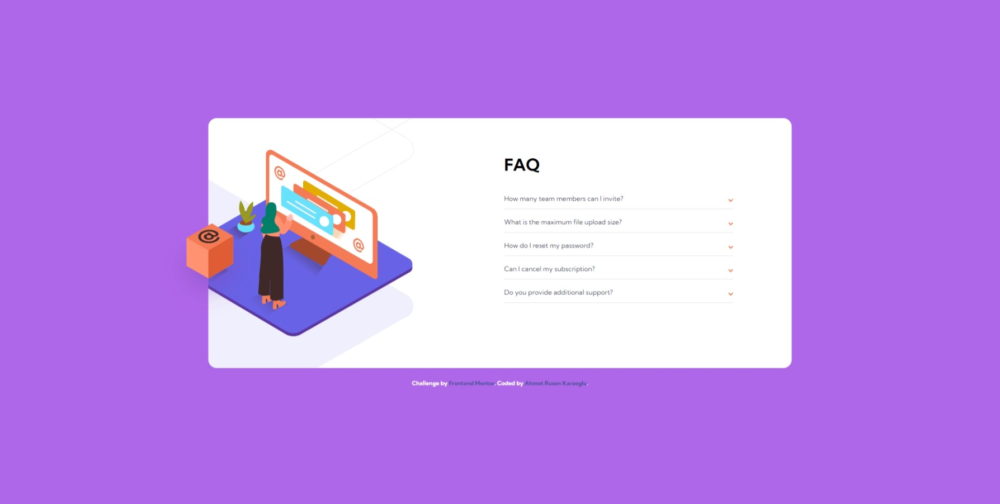

# Frontend Mentor - FAQ accordion card solution

This is a solution to the [FAQ accordion card challenge on Frontend Mentor](https://www.frontendmentor.io/challenges/faq-accordion-card-XlyjD0Oam). Frontend Mentor challenges help you improve your coding skills by building realistic projects.

## Table of contents

-   [Overview](#overview)
    -   [The challenge](#the-challenge)
    -   [Screenshot](#screenshot)
    -   [Links](#links)
-   [My process](#my-process)
    -   [Built with](#built-with)
    -   [What I learned](#what-i-learned)
    -   [Continued development](#continued-development)
-   [Author](#author)

## Overview

### The challenge

Users should be able to:

-   View the optimal layout for the component depending on their device's screen size
-   See hover states for all interactive elements on the page
-   Hide/Show the answer to a question when the question is clicked

### Screenshot

### Links

-   Solution URL: [Add solution URL here](https://your-solution-url.com)
-   Live Site URL: [Add live site URL here](https://your-live-site-url.com)

## My process

### Built with

-   Semantic HTML5 markup
-   CSS custom properties
-   Flexbox
-   CSS Grid
-   Mobile-first workflow

**Note: These are just examples. Delete this note and replace the list above with your own choices**

### What I learned

-   I have learned how to write browser specific code.

-   I have practiced how to position images.

### Continued development

-   There is not much left to do other than fix the Desktop Orange box
    position issue in Google Chrome!

-   I will add Gradient to the background color

-   I will add Shadow to the card

**Note: Delete this note and the content within this section and replace with your own plans for continued development.**

## Author

-   Github - [Ahmet Rusen Kara](https://github.com/ARKaraoglu)
-   Frontend Mentor - [@ARKaraoglu](https://www.frontendmentor.io/profile/ARKaraoglu)
